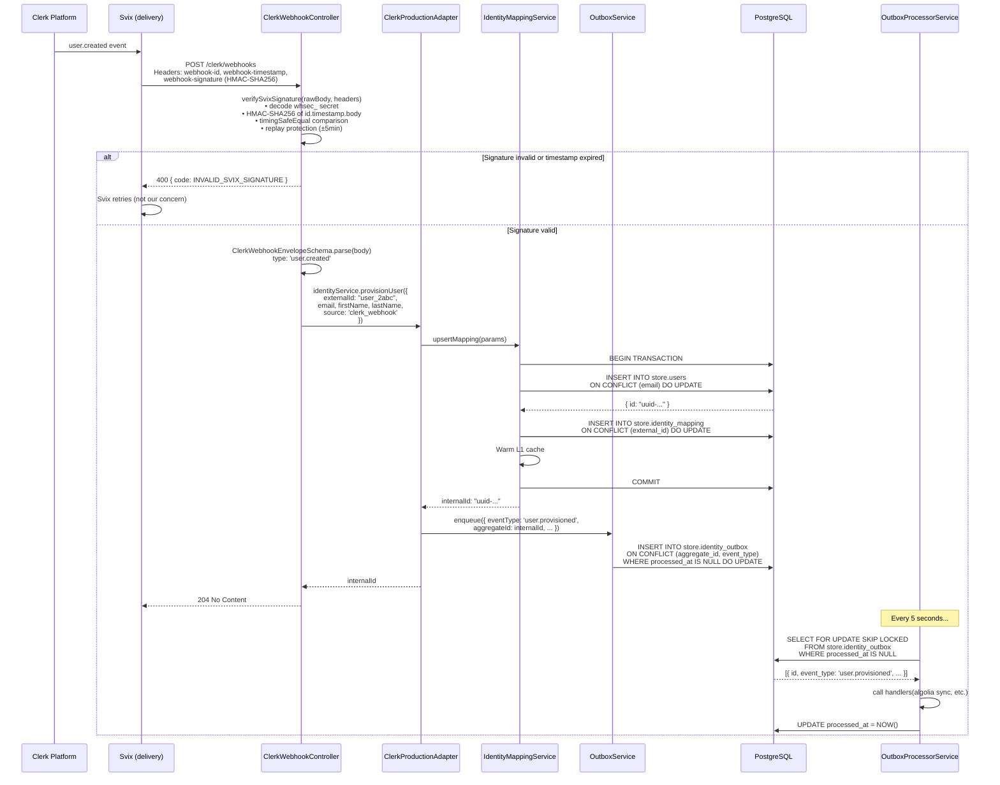
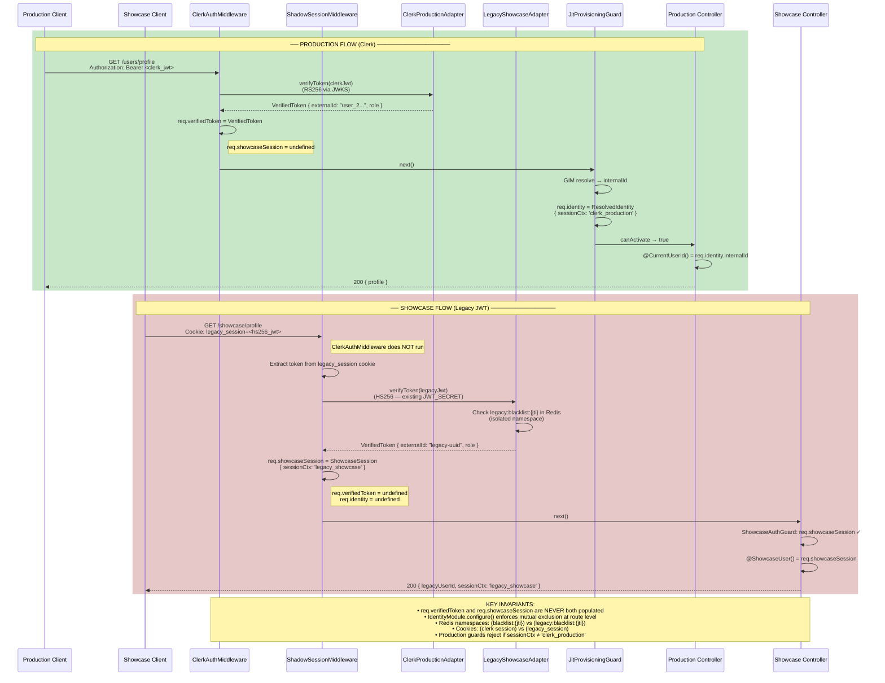

# Clerk IdP Migration — Engineering Design Document

## Architecture Blueprint

### Hexagonal Architecture Overview

```
┌───────────────────────────────────────────────────────────────────────────────────┐
│                           APPLICATION (DOMAIN LAYER)                              │
│                          ── Auth-Agnostic ──                                      │
│                                                                                   │
│   UsersController   AdminController   CartController   OrdersController           │
│         │                 │                 │                 │                   │
│         ▼                 ▼                 ▼                 ▼                   │
│   @CurrentUserId()  @CurrentUser()   @OptionalUser()   @CurrentUserId()           │
│      (internalId)  (ResolvedIdentity) (nullable)        (internalId)              │
│         │                 │                 │                 │                   │
│         └─────────────────┴─────────────────┴─────────────────┘                  │
│                                    │                                              │
│                           UsersService / OrdersService                            │
│                      (receives internalId: string — UUID)                         │
│                      (zero auth knowledge — pure domain logic)                    │
└──────────────────────────────────┬────────────────────────────────────────────────┘
                                   │ internalId (UUID)
                                   │
┌──────────────────────────────────▼────────────────────────────────────────────────┐
│                         PORTS LAYER (Identity Abstraction)                         │
│                                                                                    │
│   ┌────────────────────────────────────────────────────────────────────────────┐  │
│   │  IIdentityService (abstract class — NestJS DI token)                       │  │
│   │                                                                            │  │
│   │  + verifyToken(rawToken): Promise<VerifiedToken>                           │  │
│   │  + provisionUser(payload): Promise<string>          // returns internalId  │  │
│   │  + revokeSession(jti, externalId): Promise<void>                           │  │
│   │  + isProductionAdapter: boolean                                            │  │
│   └────────────────────────────────────────────────────────────────────────────┘  │
│                                                                                    │
│   ResolvedIdentitySchema (Zod)  VerifiedTokenSchema (Zod)  ProvisionPayload (Zod) │
└──────────────┬─────────────────────────────────────────────────────┬──────────────┘
               │ implements                                           │ implements
               │                                                     │
┌──────────────▼──────────────────┐         ┌───────────────────────▼──────────────┐
│   ClerkProductionAdapter         │         │  LegacyShowcaseAdapter                │
│   (isProductionAdapter = true)   │         │  (isProductionAdapter = false)        │
│                                  │         │                                       │
│  • JWKS/RS256 verification       │         │  • HS256 bcrypt verification          │
│  • Clerk JWKS cache (1h TTL)     │         │  • Redis namespace: legacy:blacklist  │
│  • Provisions via GIM + Outbox   │         │  • Read-only: no new provisioning     │
│  • Revokes via Clerk REST API    │         │  • Revokes to isolated namespace      │
│  • Routes: ALL except /showcase  │         │  • Routes: /showcase/* ONLY           │
└──────────┬───────────────────────┘         └──────────────────────────────────────┘
           │
┌──────────▼──────────────────────────────────────────────────────────────────────┐
│                          MIDDLEWARE CHAIN (CoR)                                   │
│                                                                                   │
│   Request arrives                                                                 │
│        │                                                                          │
│        ├── path starts with /showcase/*?                                         │
│        │      YES → ShadowSessionMiddleware                                       │
│        │              • reads legacy_session cookie / X-Legacy-Session-Token      │
│        │              • verifies via LegacyShowcaseAdapter                        │
│        │              • populates req.showcaseSession                             │
│        │              • NEVER touches req.verifiedToken or req.identity           │
│        │                                                                          │
│        ├── path is /clerk/webhooks?                                              │
│        │      YES → No auth middleware (raw body preserved for Svix sig check)   │
│        │                                                                          │
│        └── everything else                                                        │
│               → ClerkAuthMiddleware                                               │
│                   • extracts Bearer token from Authorization header               │
│                   • verifies via ClerkProductionAdapter (JWKS, RS256)            │
│                   • populates req.verifiedToken                                   │
│                                                                                   │
│   Guard Chain (after middleware, before controllers):                             │
│        RequireAuthGuard → checks req.verifiedToken exists                        │
│        JitProvisioningGuard → resolves GIM L1→L2→provision, sets req.identity   │
│        RequireRoleGuard → checks req.identity.role vs @RequireRole(...)          │
└─────────────────────────────────────────────────────────────────────────────────┘
```

### Global Identity Mapping (GIM) — N+1 Prevention

```
Inbound Request (Clerk JWT)
         │
         ▼
  externalId: "user_2abc123..."   (K-Sortable Clerk string from JWT.sub)
         │
         ▼
  ┌─────────────────────────────────────────────────────────────┐
  │           IdentityMappingService (REQUEST scoped)            │
  │                                                              │
  │  L1 Cache: Map<externalId, internalId>                       │
  │  (lives for exactly 1 request — no global state)            │
  │                                                              │
  │  resolve("user_2abc123...")                                  │
  │       │                                                      │
  │       ├── L1 hit? ─── YES ──→ return cached UUID (0ms)      │
  │       │                                                      │
  │       └── L1 miss                                           │
  │               │                                             │
  │               ▼                                             │
  │         SELECT internal_id FROM store.identity_mapping      │
  │         WHERE external_id = $1                              │
  │               │                                             │
  │               ├── Row found → promote to L1, return UUID    │
  │               │                                             │
  │               └── Row missing → JitProvisioningGuard        │
  │                       → provisionUser()                     │
  │                       → upsertMapping() [ON CONFLICT safe]  │
  │                       → return new UUID                     │
  └─────────────────────────────────────────────────────────────┘
         │
         ▼
  internalId: "550e8400-e29b-41d4-a716-446655440000"  (UUID for all FK queries)
         │
         ├── store.users.id
         ├── store.orders.user_id
         ├── store.cart_items.user_id
         └── store.wishlist.user_id
               (All FK tables use UUID — zero schema changes required)

  Batch resolution (list endpoints — prevents N+1):
  ┌─────────────────────────────────────────────────────────────┐
  │  resolveBatch(["user_2a...", "user_2b...", "user_2c..."])    │
  │                                                              │
  │  1. Check L1 for each ID                                     │
  │  2. Single DB query for all L1 misses:                       │
  │     SELECT external_id, internal_id FROM store.identity_mapping │
  │     WHERE external_id = ANY($1)                              │
  │  3. Promote all results to L1                                │
  │  Returns: Map<externalId, internalId>                        │
  └─────────────────────────────────────────────────────────────┘
```

### Transactional Outbox — Dual-Write Prevention

```
  provisionUser() call
         │
         ▼
  ┌──────────────────────────────────────────────────────────────┐
  │  PostgreSQL Transaction (atomic)                              │
  │                                                              │
  │  1. INSERT INTO store.users ... ON CONFLICT DO UPDATE        │
  │  2. INSERT INTO store.identity_mapping ... ON CONFLICT DO UPDATE │
  │  3. INSERT INTO store.identity_outbox                        │
  │     (event_type, aggregate_id, external_id, payload)        │
  │                                                              │
  │  Either ALL THREE succeed or NONE do (ACID guarantee)       │
  └──────────────────────────────────────────────────────────────┘
         │
         ▼  (request continues — no waiting for downstream)
  User gets their response immediately

  Background (every 5 seconds):
  ┌──────────────────────────────────────────────────────────────┐
  │  OutboxProcessorService                                      │
  │                                                              │
  │  SELECT FOR UPDATE SKIP LOCKED                               │
  │  → fetch pending events (FIFO, batch=50)                     │
  │                                                              │
  │  For each event:                                             │
  │    → call registered handlers                                │
  │    → Algolia user index sync                                 │
  │    → Admin notification (user.deactivated)                   │
  │    → Any future consumers (add handler, no schema change)    │
  │                                                              │
  │  Success → UPDATE processed_at = NOW()                       │
  │  Failure → UPDATE attempts++, next_retry_at = NOW() + 2^n s  │
  │  5 failures → event abandoned (inspect last_error column)    │
  └──────────────────────────────────────────────────────────────┘
```

---

## Mermaid System Sequence Diagrams

### Diagram 1: Production Clerk Auth Flow (Happy Path + JIT Provisioning)

```mermaid
sequenceDiagram
    participant C as Client
    participant MW as ClerkAuthMiddleware
    participant CA as ClerkProductionAdapter
    participant JIT as JitProvisioningGuard
    participant GIM as IdentityMappingService
    participant DB as PostgreSQL (store.*)
    participant OB as OutboxService
    participant CTRL as Controller

    C->>MW: GET /users/profile<br/>Authorization: Bearer <clerk_jwt>

    MW->>CA: verifyToken(rawToken)
    CA->>CA: jose.jwtVerify(token, JWKS)<br/>(JWKS cached 1h — zero network I/O)
    CA-->>MW: VerifiedToken { externalId, email, role, jti }

    MW->>MW: req.verifiedToken = VerifiedToken
    MW->>JIT: next() → guard runs

    JIT->>GIM: resolve(externalId)
    GIM->>GIM: L1 cache miss

    alt User exists in identity_mapping (normal path)
        GIM->>DB: SELECT internal_id FROM store.identity_mapping<br/>WHERE external_id = $1
        DB-->>GIM: { internal_id: "uuid-..." }
        GIM->>GIM: Promote to L1 cache
        GIM-->>JIT: internalId: "uuid-..."
    else JIT provisioning (webhook not yet arrived)
        GIM->>DB: SELECT internal_id FROM store.identity_mapping<br/>WHERE external_id = $1
        DB-->>GIM: (empty — webhook in-flight)
        GIM-->>JIT: null

        JIT->>CA: provisionUser({ externalId, email, role, source: 'jit_guard' })
        CA->>DB: BEGIN TRANSACTION
        CA->>DB: INSERT INTO store.users<br/>ON CONFLICT (email) DO UPDATE
        DB-->>CA: { id: "new-uuid" }
        CA->>DB: INSERT INTO store.identity_mapping<br/>ON CONFLICT (external_id) DO UPDATE
        CA->>OB: INSERT INTO store.identity_outbox<br/>(user.provisioned event)
        CA->>DB: COMMIT
        CA-->>JIT: internalId: "new-uuid"
    end

    JIT->>JIT: req.identity = ResolvedIdentity {<br/>  internalId, externalId, email,<br/>  role, sessionCtx: 'clerk_production'<br/>}

    JIT->>CTRL: canActivate → true

    CTRL->>CTRL: @CurrentUserId() → req.identity.internalId
    CTRL->>DB: SELECT * FROM store.users WHERE id = $1
    DB-->>CTRL: user row
    CTRL-->>C: 200 { data: { id, email, firstName, ... } }

    Note over OB,DB: Background: OutboxProcessor delivers<br/>user.provisioned to Algolia/downstream<br/>every 5 seconds (at-least-once)
```



### Diagram 2: Clerk Webhook Flow (Normal Provisioning Path)



### Diagram 3: Dual-Auth Flow (Production vs Showcase — Side by Side)



### Diagram 4: Zero-Downtime Cutover State Machine

```mermaid
stateDiagram-v2
    [*] --> LegacyOnly: Current state

    state LegacyOnly {
        note right of LegacyOnly
            IDENTITY_PROVIDER=legacy
            All traffic → LegacyShowcaseAdapter
            Clerk not yet configured
        end note
    }

    LegacyOnly --> DualRun: Deploy IdentityModule<br/>IDENTITY_PROVIDER=clerk

    state DualRun {
        note right of DualRun
            Production → ClerkProductionAdapter
            /showcase/* → LegacyShowcaseAdapter
            GIM syncs users via JIT + webhooks
            Outbox delivers to downstream
        end note

        state "Traffic Routing" as TR {
            [*] --> CheckRoute
            CheckRoute --> ClerkAdapter: path != /showcase/*
            CheckRoute --> LegacyAdapter: path == /showcase/*
            ClerkAdapter --> [*]
            LegacyAdapter --> [*]
        }
    }

    DualRun --> ClerkFull: All users migrated<br/>Showcase sign-off complete

    state ClerkFull {
        note right of ClerkFull
            IDENTITY_PROVIDER=clerk (default)
            Legacy adapter: showcase only (frozen)
            LegacyShowcaseAdapter: dormant shadow
        end note
    }

    ClerkFull --> DualRun: Emergency rollback<br/>IDENTITY_PROVIDER=legacy<br/>(env var toggle, redeploy)

    DualRun --> LegacyOnly: Full rollback<br/>(remove IdentityModule)
```

---

## Secondary Effects Audit — Migration Map

### Guard Replacement Table

| File | Before | After |
|------|--------|-------|
| `users.controller.ts` | `@UseGuards(AuthGuard('jwt'))` | `@UseGuards(RequireAuthGuard, JitProvisioningGuard)` |
| `auth.controller.ts` | `@UseGuards(AuthGuard('jwt'))` | `@UseGuards(RequireAuthGuard)` (no JIT needed — auth self-referential) |
| `cart.controller.ts` | `@UseGuards(OptionalJwtGuard)` | `@UseGuards(OptionalIdentityGuard)` |
| `admin/*.controller.ts` | `@UseGuards(AuthGuard('jwt'), RolesGuard)` + `@Roles('admin')` | `@UseGuards(RequireRoleGuard, JitProvisioningGuard)` + `@RequireRole('admin')` |
| `webhook.controller.ts` | `@UseGuards(AuthGuard('jwt'), RolesGuard)` + `@Roles('admin')` | `@UseGuards(RequireRoleGuard, JitProvisioningGuard)` + `@RequireRole('admin')` |
| `orders/*.controller.ts` | `@UseGuards(AuthGuard('jwt'))` | `@UseGuards(RequireAuthGuard, JitProvisioningGuard)` |
| `wishlist.controller.ts` | `@UseGuards(OptionalJwtGuard)` | `@UseGuards(OptionalIdentityGuard)` |
| showcase routes (new) | n/a | `@UseGuards(ShowcaseAuthGuard)` |

### Parameter Injection Replacement Table

| Pattern | Before | After |
|---------|--------|-------|
| Get user ID from request | `@Request() req: any` → `req.user.userId` | `@CurrentUserId() userId: string` |
| Get full identity | `@Request() req: any` → `req.user` | `@CurrentUser() user: ResolvedIdentity` |
| Optional auth (cart, wishlist) | `@Request() req: any` → `req.user?.userId` | `@OptionalUser() user: ResolvedIdentity \| null` → `user?.internalId` |
| Showcase routes | `@Request() req: any` → `req.user.userId` | `@ShowcaseUser() session: ShowcaseSession` → `session.legacyUserId` |

### Dependency Injection Strategy

```typescript
// app.module.ts — Import IdentityModule globally
// (replaces AuthModule + PassportModule + JwtModule)

@Module({
  imports: [
    IdentityModule,   // ← replaces AuthModule
    // PassportModule  ← REMOVE (Passport no longer needed)
    // JwtModule       ← REMOVE (jose handles Clerk, legacy adapter keeps jsonwebtoken)
    UsersModule,
    CartModule,
    // ... all other modules unchanged
  ],
})
export class AppModule {}

// AuthModule becomes LegacyShowcaseModule (rename only — no logic changes)
// The legacy AuthService, JwtStrategy, etc. remain as-is but are
// only imported by the showcase showcase routes.
```

### RDBMS FK Compatibility

```sql
-- All existing FK columns continue to use UUID:
--   store.orders.user_id       UUID REFERENCES store.users(id)
--   store.cart_items.user_id   UUID REFERENCES store.users(id)
--   store.refresh_tokens.user_id UUID REFERENCES store.users(id)
--
-- The GIM layer translates Clerk strings → UUID BEFORE any service call.
-- No FK columns change type. No data migrations required.
-- The identity_mapping table is the ONLY new structural addition.

-- Clerk user_2abc123 → GIM lookup → UUID 550e8400-e29b-41d4-a716-446655440000
-- All queries: SELECT * FROM store.orders WHERE user_id = $1
--              (value is always the UUID, never the Clerk string)
```

---

## Environment Variables Required

```bash
# Clerk Production
CLERK_ISSUER_URL=https://clerk.your-domain.com        # From Clerk Dashboard
CLERK_SECRET_KEY=sk_live_...                           # Clerk secret key
CLERK_WEBHOOK_SECRET=whsec_...                         # Svix webhook secret
CLERK_AUDIENCE=https://api.your-domain.com             # Optional JWT audience

# Feature Flag (Zero-Downtime Cutover)
IDENTITY_PROVIDER=clerk                                # or 'legacy' for rollback

# Legacy System (unchanged — still used by showcase adapter)
JWT_SECRET=your-existing-secret
JWT_REFRESH_SECRET=your-existing-refresh-secret

# Database (unchanged)
DATABASE_URL=postgresql://...

# Redis (unchanged — legacy adapter uses isolated namespace)
REDIS_URL=redis://...
```
